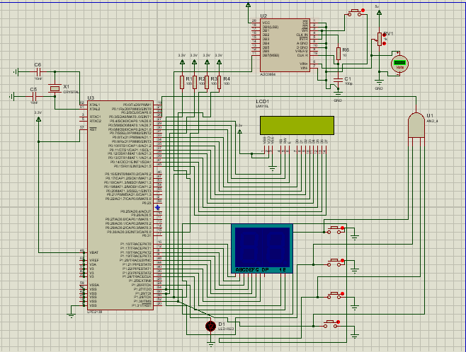
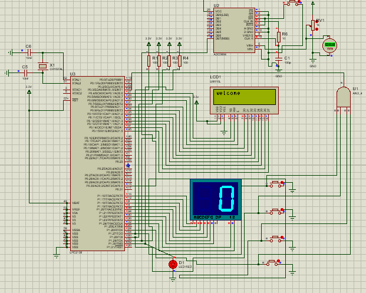
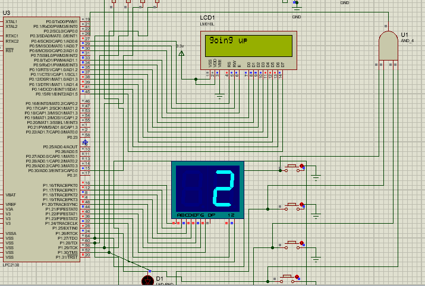
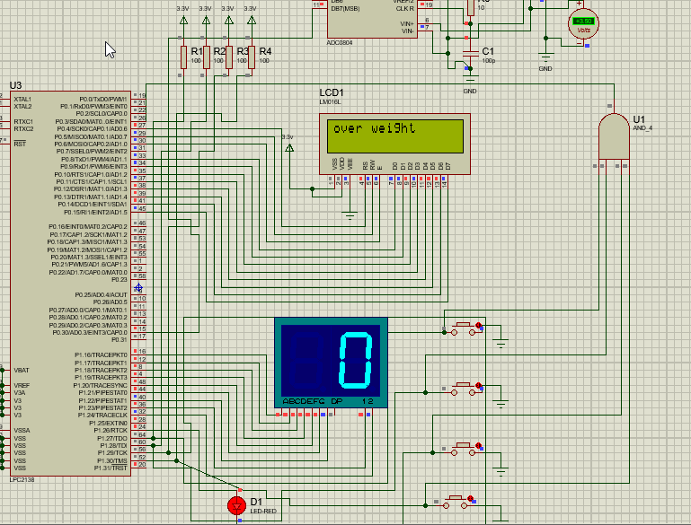

# Elevator System Simulation

This project is a comprehensive design and implementation of an elevator control system using a microcontroller. The project is divided into four main sections: building the elevator model, constructing the circuit, implementing the control code, and simulating the final system. Below, I’ll provide a detailed breakdown of each part along with descriptions and example outputs.

## Project Overview
The goal of this project is to simulate a functional elevator system that responds to various user inputs such as floor selection, weight limits, and door controls. The implementation uses an **LCD display**, **7-segment displays**, and multiple **LEDs** to indicate different statuses. Additionally, a **potentiometer and an ADC module** are used to simulate weight inputs.

The elevator operates on a 4-floor system (Ground, 1st, 2nd, and 3rd floors) and responds according to set rules and constraints.

---

## Part 1: **System Design**

The system design includes defining the elevator’s basic components, such as the display interfaces and control mechanisms. Below are the primary design considerations:

1. **Welcome Message**:  
   The elevator displays a *"Welcome"* message when it is first turned on, and this message is repeated every time the elevator reaches a floor and the doors open.

2. **Weight Management**:  
   The elevator uses a potentiometer connected to an ADC module to monitor weight. If the weight exceeds a set threshold, the system will display an *"Overweight"* warning and prevent movement until the weight is within acceptable limits.

3. **Floor Navigation**:  
   The elevator displays the current floor on a 7-segment display. It updates the display as it moves up or down and shows messages like *"Going Up"* or *"Going Down"* to indicate its direction.

4. **Door Status**:  
   An LED indicates whether the door is open or closed. When the door is open, the LED is ON, and when closed, it turns OFF.

5. **User Inputs**:  
   The system has four buttons corresponding to each floor. The user can press any of these buttons to direct the elevator to a specific floor. Additional safety features, such as preventing movement when doors are open, are also incorporated.

### Example Output:

- **Initial State**:  
  Displays *"Welcome"* and the current floor.

- **Weight Exceeded**:  
  When the weight exceeds the limit, the system displays an *"Overweight"* warning and waits for the weight to drop.

---

## Part 2: **Circuit Design**

The next step is to build the circuit for the elevator system. This includes wiring the control buttons, LEDs, displays, and ADC.

### Circuit Components:

1. **7-Segment Display**:  
   Shows the current floor, with 0 representing Ground, 1 for the 1st floor, and so on.

2. **LCD Display**:  
   Used to show messages such as *"Welcome"*, *"Going Up"*, *"Going Down"*, and *"Overweight"*.

3. **Buttons for Floor Selection**:  
   There are four buttons for the four floors. These buttons are connected to an interrupt system to update the elevator’s destination.

4. **Potentiometer with ADC Module**:  
   Simulates weight by varying resistance. If the resistance indicates a value beyond the permissible weight, the system triggers the *"Overweight"* warning.

5. **LED for Door Status**:  
   A single LED represents the door's status. It’s ON when the door is open and OFF when closed.

6. **Microcontroller Setup**:  
   The microcontroller controls all the components and manages inputs and outputs through various pins.

### Circuit Design Example:

---

## Part 3: **Code Implementation**

The code is structured to simulate a functional elevator system using a microcontroller. The implementation uses multiple functions to handle different tasks, such as moving the elevator, updating displays, and responding to user inputs.

### Code Breakdown:

1. **General Variables**:  
   Common variables like the current floor (`Flr`), door status (`Door`), and a loop counter (`i`) are defined.

2. **Helper Functions**:  
   - **Delay Function**: Introduces a delay for timing the elevator’s movements.
   - **7-Segment Conversion (`bcd_to_7seg`)**: Converts the floor number to a format suitable for the 7-segment display.
   - **LCD Commands (`lcd_cmd`)**: Sends instructions to the LCD screen for displaying messages.
   - **Update Functions**: Functions that handle updating the floor number, door status, and user inputs.

3. **Main Control Logic**:  
   The main logic handles transitions between floors, checks the weight limit, and responds to interrupt signals when a new destination is requested.

## Part 4: **Simulation and Testing**

Finally, the system is tested using simulation software like Proteus or a similar microcontroller simulation environment. The simulation helps validate the following features:

1. **Initial State**:  
   Displays *"Welcome"* and waits for user input.

2. **Handling Overweight Scenarios**:  
   If the weight exceeds the limit, it prevents the elevator from moving and displays *"Overweight"* until the weight is reduced.

3. **Floor Navigation**:  
   Moves smoothly between floors, updating the display and showing directional messages.

### Example Outputs:

- **Idle State**:  
  Shows the elevator waiting at the ground floor with doors open.

- **During Movement**:  
  Shows messages like *"Going Up"* and *"Going Down"*.

- **Weight Error**:  
  Displays *"Overweight"* and prevents movement.

---

## How to Run the Project

1. **Set Up the Circuit**:  
   Connect the microcontroller, displays, LEDs, and buttons as shown in the circuit diagram.

2. **Upload the Code**:  
   Use an appropriate IDE to upload the code to your microcontroller.

3. **Start the Simulation**:  
   Run the simulation in Proteus (or similar software) and test the elevator's functionality.

4. **Check Responses**:  
   Press floor buttons, modify the weight using the potentiometer, and observe how the system responds to different inputs.

---

